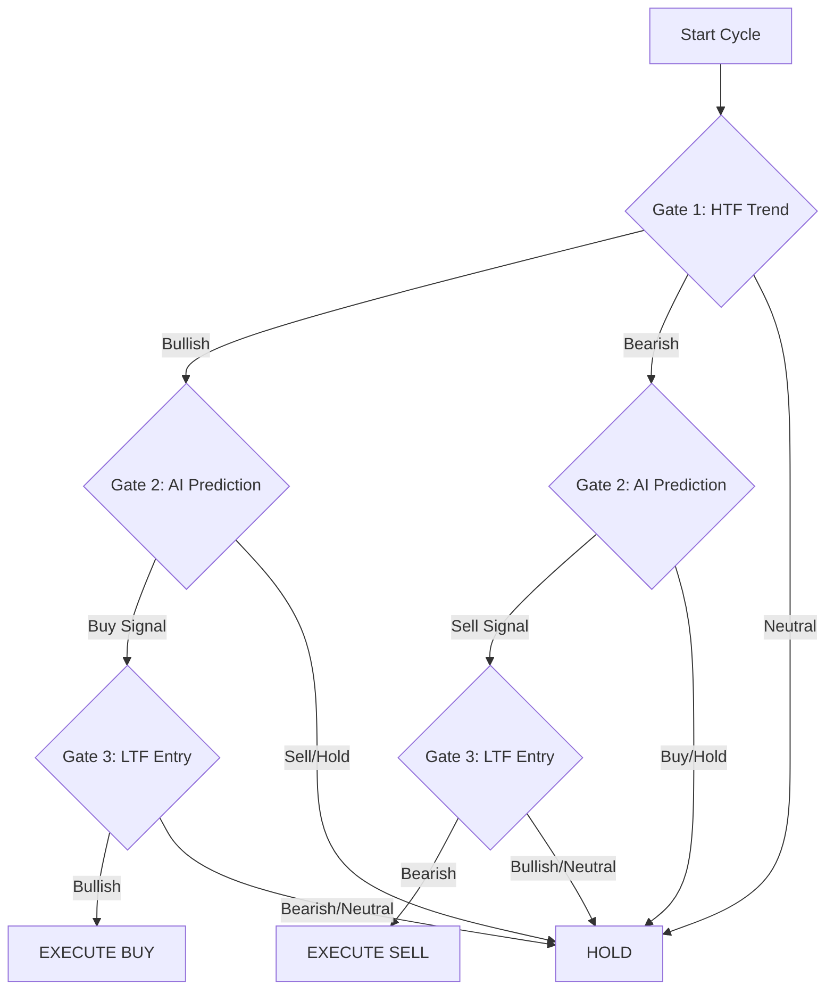

# XAUUSD AI Bot Architecture

This document explains how your trading bot makes decisions. It operates like a **Hedge Fund Analyst**, using multiple layers of confirmation before taking a trade.

## The "Waterfall" Logic
The bot uses a top-down approach. A trade is only executed if it passes through **3 Gates**:

### Gate 1: The Big Picture (30m & 15m)
-   **Goal**: Determine the dominant market direction.
-   **Logic**:
    -   If Price > EMA 50 on **BOTH** 30m and 15m charts → **BULLISH Bias**.
    -   If Price < EMA 50 on **BOTH** 30m and 15m charts → **BEARISH Bias**.
    -   Otherwise → **NEUTRAL** (No Trade).

### Gate 2: The Brain (5m)
-   **Goal**: Predict the exact next move.
-   **Logic**:
    -   The **LSTM Neural Network** analyzes the last 60 candles (Price, RSI, MACD, ATR, Bollinger Bands, SMC).
    -   It predicts the **Exact Closing Price** of the next candle.
    -   If Predicted Price > Current Price + Threshold → **BUY Signal**.
    -   If Predicted Price < Current Price - Threshold → **SELL Signal**.

### Gate 3: The Sniper (3m & 1m)
-   **Goal**: Time the entry perfectly.
-   **Logic**:
    -   Checks if the momentum on the 1-minute and 3-minute charts aligns with the trade.
    -   This prevents buying at the very top of a small pullback.

---

## Risk Management (The Safety Net)
Once a trade is approved, the **MT5RiskManager** calculates the safety parameters:

1.  **Stop Loss (SL)**:
    -   **BUY**: Placed below the recent **Swing Low** (Order Block).
    -   **SELL**: Placed above the recent **Swing High**.
    -   *Fallback*: If no swing point is found, it uses 1.5x ATR (Volatility-based SL).
2.  **Take Profit (TP)**:
    -   Automatically set to **2x the Risk** (1:2 Risk-Reward Ratio).
3.  **Position Sizing**:
    -   Calculates exactly how many lots to buy so you only risk **1% - 2%** of your account.

## Execution
-   The bot sends the order directly to **MetaTrader 5**.
-   It attaches the SL and TP to the order immediately, so you are protected even if the bot crashes.
