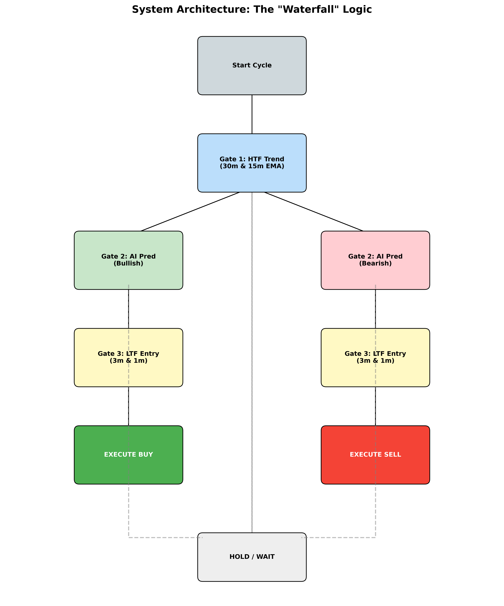

# Project Summary: AI-Powered XAUUSD Trading Bot

## 1. Project Overview
This project is a sophisticated, AI-driven trading bot designed for the Gold (XAUUSD) market. It leverages a hybrid approach combining **Deep Learning (LSTM)** for price prediction with **Smart Money Concepts (SMC)** for structural analysis. The system operates autonomously, fetching real-time data, analyzing market conditions through a multi-stage "waterfall" logic, and executing trades via **MetaTrader 5 (MT5)**.

## 2. Project Workflow
The following diagram illustrates the end-to-end flow of data through the system, from raw market data to trade execution.


1.  **Data Sources**: Real-time price data is fetched from MT5, and correlated asset data (US10Y) is fetched via YFinance.
2.  **Preprocessing**: Data is cleaned, and technical indicators (RSI, MACD, EMA) + SMC features are calculated.
3.  **AI Model**: The LSTM model analyzes the processed data to predict the next candle's closing price.
4.  **Decision Logic**: The "Waterfall" logic validates the prediction against multiple timeframes.
5.  **Execution**: If all conditions are met, a trade is placed on MT5 with dynamic SL/TP.

## 3. System Architecture
The bot functions like a hedge fund analyst, utilizing a strict decision-making process involving three "gates" before executing a trade. This "Waterfall" logic ensures high-probability setups.



### The "Waterfall" Logic Details
1.  **Gate 1: HTF Trend (30m & 15m)**
    *   Determines the dominant market direction using the 50 EMA.
    *   **Condition**: Price must be above (Bullish) or below (Bearish) the 50 EMA on *both* timeframes.
2.  **Gate 2: The Brain (5m)**
    *   Uses an LSTM Neural Network to predict the *exact closing price* of the next candle.
    *   **Inputs**: Price, RSI, MACD, ATR, Bollinger Bands, and SMC features (Distance to Swing Highs/Lows).
    *   **Condition**: Predicted price must show a significant move in the direction of the HTF trend.
3.  **Gate 3: The Sniper (3m & 1m)**
    *   Ensures precise entry timing by checking momentum on lower timeframes.
    *   **Condition**: Momentum must align with the trade direction to avoid buying tops or selling bottoms.

## 4. Technical Stack
*   **Language**: Python 3.x
*   **Core Libraries**:
    *   `tensorflow`: For the LSTM Deep Learning model.
    *   `MetaTrader5`: For live data fetching and trade execution.
    *   `pandas`, `numpy`: For data manipulation and analysis.
    *   `pandas_ta`: For technical indicators (RSI, MACD, EMA, ATR).
    *   `joblib`: For saving/loading data scalers.
    *   `yfinance`: For fetching correlated asset data (US10Y).
*   **Visualization**: `streamlit`, `plotly` (for the dashboard).
*   **Notifications**: WhatsApp integration via `callmebot`.

## 5. Key Components & File Structure

### Core Scripts
*   **`main.py` (The Engine)**:
    *   Orchestrates the entire trading loop.
    *   Fetches multi-timeframe data from MT5.
    *   Integrates correlated assets (DXY, US10Y).
    *   Runs the "Waterfall" logic to generate signals.
    *   Calculates dynamic Stop Loss (SL) and Take Profit (TP) based on SMC and ATR.
    *   Updates the `bot_state.json` for the dashboard.
*   **`model_training.py` (The Teacher)**:
    *   Handles data preprocessing and feature engineering.
    *   Constructs and trains the LSTM neural network.
    *   Saves the trained model (`best_xauusd_model.keras`) and scalers.
*   **`live_trader.py` (The Manager)**:
    *   Contains the `MT5RiskManager` class.
    *   Manages account risk, position sizing (1-2% risk per trade), and trade execution.
    *   Checks for high-impact news events.
*   **`mt5_handler.py`**:
    *   Wrapper functions for the `MetaTrader5` library.
    *   Handles connection, data retrieval, and order placement.

### Data & Models
*   **`best_xauusd_model.keras`**: The trained LSTM model.
*   **`scaler.pkl` / `target_scaler.pkl`**: Objects for normalizing input features and target prices.
*   **`bot_state.json`**: Real-time state file used to sync data between the backend and the dashboard.

## 6. Key Features
*   **Smart Money Concepts (SMC)**: dynamic Stop Loss placement based on recent Swing Highs/Lows (Fractals) or Order Blocks.
*   **Correlated Assets**: Incorporates Dollar Index (DXY) and US 10-Year Yield (US10Y) into the decision process.
*   **Risk Management**:
    *   Automatic Lot Size calculation based on account balance.
    *   Fixed Risk-to-Reward ratio (1:2).
    *   Drawdown protection.
*   **Real-Time Dashboard**: A Streamlit-based interface to monitor live signals, predicted prices, and trade setups.
*   **Notifications**: Instant WhatsApp alerts for executed trades.

## 7. Setup & Usage
1.  **Prerequisites**: Python installed, MetaTrader 5 terminal running and logged in.
2.  **Configuration**: Update `main.py` with the correct symbol (e.g., `XAUUSD` or `GOLD`).
3.  **Run**:
    ```bash
    python main.py
    ```
4.  **Monitor**: The console provides detailed logs of every cycle, including trend bias, AI predictions, and potential trade setups.
